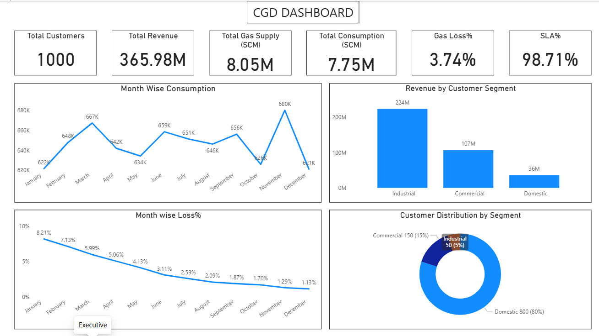
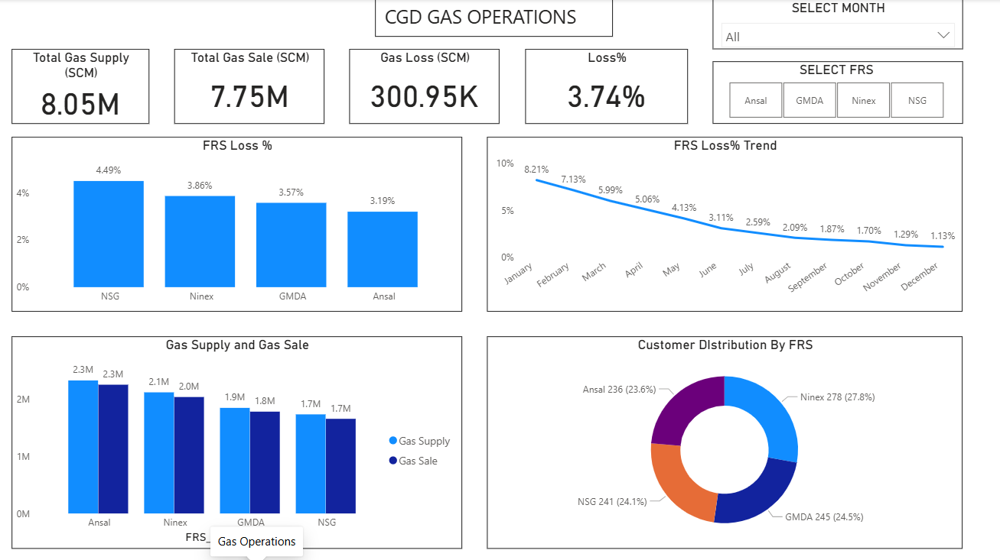
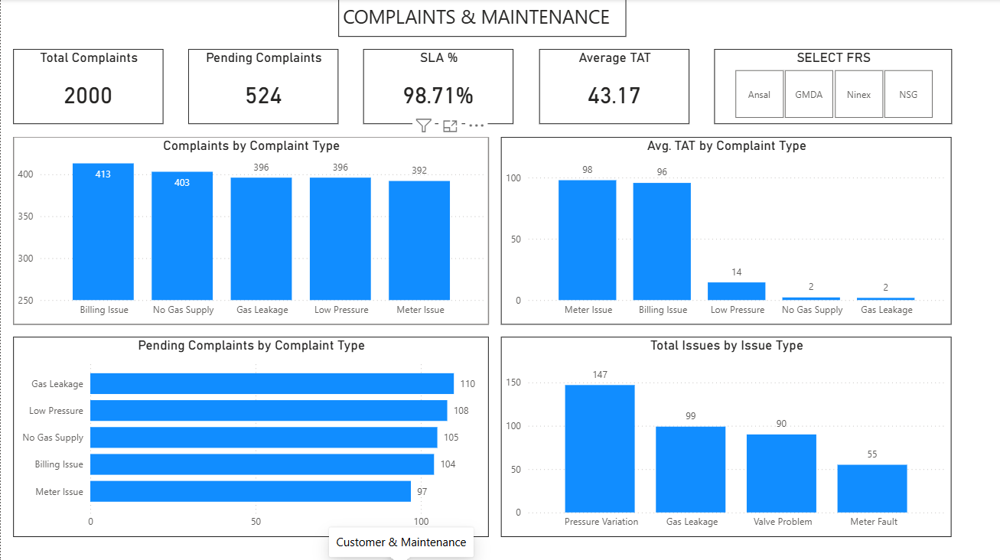

# City Gas Distribution (CGD) Operations Analytics Dashboard

## 📌 Project Overview

This project is an end-to-end Data Analytics solution built to analyze City Gas Distribution (CGD) operations.

The objective of this project is to monitor gas consumption, revenue performance, gas distribution losses, FRS (Field Regulating Station) efficiency, customer complaints, SLA performance, and maintenance activities.

The dashboard helps operations teams identify gas loss trends, improve complaint resolution performance, and monitor overall operational efficiency.


---

## 🛠 Tools & Technologies Used

- MySQL
- Power BI
- Power Query
- DAX (Data Analysis Expressions)
- Data Modelling
- Excel / CSV


---

## 📂 Dataset Overview

The project uses multiple operational datasets:

### Customer Data
Contains customer details:
- Customer ID
- Customer Type
- Zone
- Area
- FRS Mapping
- Customer Status


### Gas Consumption Data
Contains monthly gas consumption details:
- Meter readings
- Actual consumption
- Corrected consumption (SCM)
- Revenue generated


### FRS Data
Contains gas distribution information:
- Gas input
- Gas sales
- Gas loss
- Pressure details


### Complaint Data
Tracks customer complaints:
- Complaint category
- Priority
- Resolution time
- SLA performance


### Maintenance Data
Tracks:
- Inspection activities
- Issues identified
- Maintenance status


---

# Database Design

Created a relational database in MySQL with:

- Primary Keys
- Foreign Keys
- Fact and Dimension relationships


Database tables:

```
Customers
    |
    |
Consumptions


FRS_Master
    |
    |----- FRS
    |
    |----- Maintenance


Customers
    |
    |
Complaints
```

---

# SQL Analysis Performed

SQL concepts implemented:

✔ Database creation  
✔ Data cleaning  
✔ Data type conversion  
✔ Joins  
✔ Aggregations  
✔ CASE statements  
✔ CTE  
✔ Window Functions  
✔ KPI calculations  


Analysis performed:

- Customer segmentation analysis
- Monthly consumption trends
- Customer type revenue contribution
- FRS-wise gas loss analysis
- Complaint SLA analysis
- Maintenance issue analysis


---

# Power BI Dashboard

Created 3 interactive dashboard pages:


## 1️⃣ Executive Overview Dashboard

KPIs:

- Total Customers
- Total Revenue
- Total Gas Input
- Total Gas Consumption
- Gas Loss %
- SLA %

Insights:

- Monthly gas consumption trend
- Revenue contribution by customer segment
- Customer distribution
- Monthly gas loss monitoring


---

## 2️⃣ Gas Operations Dashboard

Analyzed:

- FRS-wise gas input
- Gas consumption
- Gas loss percentage
- Monthly loss reduction trend


Key operational metric:

```
Gas Loss % =
(Gas Input - Gas Consumption)
/ Gas Input
```

---

## 3️⃣ Complaint & Maintenance Dashboard

Tracked:

- Total complaints
- Pending complaints
- SLA compliance
- Average Turn Around Time (TAT)
- Maintenance issues


SLA Rules:

| Complaint Type | Target Resolution |
|---|---|
| Gas Leakage | <= 3 Hours |
| No Gas Supply | <= 3 Hours |
| Pressure Issue | <= 24 Hours |
| Meter Issue | <= 7 Days |
| Billing Issue | <= 7 Days |


---

# Dashboard Preview

## Executive Dashboard




## Gas Operations Dashboard




## Complaint & Maintenance Dashboard




---

# Key Insights

📌 Analyzed **8.05M SCM** gas input  

📌 Monitored **7.75M SCM** gas consumption  

📌 Tracked **₹365.98M revenue**

📌 Reduced gas loss trend analysis from approximately **8% to 1%**

📌 Overall gas loss monitored at **3.74%**

📌 Achieved complaint SLA tracking of **98%+**

📌 Identified high-loss FRS locations for operational improvement


---

# Business Impact

This analytics solution enables CGD operations teams to:

- Monitor distribution losses
- Identify high-loss FRS stations
- Improve maintenance planning
- Track complaint resolution efficiency
- Improve customer service performance


---

# Skills Demonstrated

- SQL Data Analysis
- Database Design
- Data Cleaning
- Data Modelling
- Power Query
- DAX Measures
- KPI Development
- Business Intelligence Reporting


---

# Project Workflow


Raw Data (CSV)
        |
        ↓
MySQL Database
        |
        ↓
SQL Cleaning & Analysis
        |
        ↓
Power BI Data Model
        |
        ↓
Power Query Transformation
        |
        ↓
DAX Measures
        |
        ↓
Interactive Dashboard


---

## Author

Rahul Nayal
